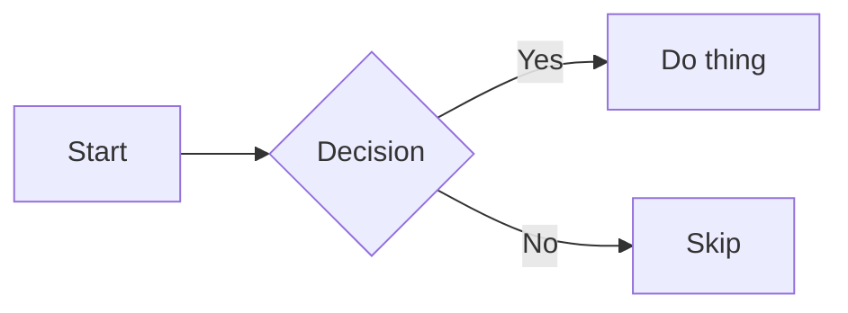
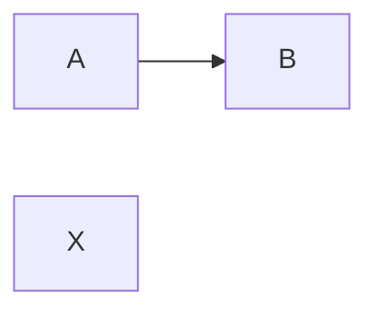

# Mermaid Polish

Status: shipped in Phase 0.3 · Issue: [#3](https://github.com/fadymondy/mark-it-down/issues/3)

Mermaid diagrams in View mode now ship with proper interaction: zoom, pan, copy-source, a clear error UX, and live theme sync — no more flat-static diagrams or blank failures.

## At a glance

| | |
|---|---|
| **Where** | Any ` ```mermaid ` code block in a markdown file |
| **Zoom** | Hover the diagram → `+` / `−` / `1×` controls. Or hold Cmd/Ctrl and scroll over the diagram. |
| **Pan** | Click and drag the diagram. |
| **Copy source** | Hover → `Copy` button posts the original mermaid source to the clipboard via the host's existing `copy` message channel. |
| **Theme sync** | When VSCode's color theme changes mid-session, every mermaid diagram re-renders with the matching theme (dark / default). |
| **Error UX** | Failed renders show a structured error with the title, the actual mermaid error message, and a collapsible source view — instead of a blank box. |

## What ships

### Zoom & pan

The mermaid diagram is wrapped in a `.mermaid-stage` element that holds the SVG. Zoom and pan are CSS `transform: translate(x, y) scale(s)` applied to that stage:

- **Buttons** (`+`, `−`, `1×`) clamp scale to `[0.2, 6]` and reset on `1×`.
- **Mouse wheel** with Cmd/Ctrl modifier adjusts scale by 1.1× per tick. The `passive: false` listener calls `preventDefault()` so the page itself doesn't scroll.
- **Pointer drag** updates `(x, y)` translation. `setPointerCapture` keeps the drag attached even if the cursor leaves the stage. Cursor switches between `grab` and `grabbing` for affordance.
- Both transforms compose on the same `transform` matrix (translate first, scale second) so panning behavior is intuitive at any zoom.

### Copy source

The original mermaid source is stashed on `dataset.mermaidSource` before rendering. The `Copy` button reads from there and posts `{type: 'copy', text}` to the extension host (which uses the existing clipboard handler from v0.1).

### Error UX

When `mermaid.render()` rejects (invalid syntax, unsupported diagram type, etc.):

```
┌─────────────────────────────────────────┐
│ Mermaid render failed                   │
│ Lexical error on line 3. ...            │
│ ▶ Diagram source                        │
└─────────────────────────────────────────┘
```

The host class flips from `.mermaid-rendered` to `.mermaid-error`, which switches the layout to left-aligned text and uses `--vscode-errorForeground` for the title. The `<details>` element contains the original mermaid source for debugging — collapsed by default to keep the visual footprint small.

### Theme sync

Phase 0.1 initialized mermaid once with the theme it saw at first render and never updated it. Phase 0.3 tracks `mermaidThemeKind` separately from the global `lastThemeKind`:

- `initMermaid()` early-returns if the requested kind matches the last init.
- When the host posts an `update` message with a new `themeKind`, the webview calls `initMermaid(newKind)` to reconfigure mermaid AND `rerenderMermaidForTheme()` to re-render every existing diagram with the new theme.
- `rerenderMermaidForTheme()` clears the rendered SVG of each diagram and re-runs `renderMermaidDiagrams()`, which uses the stashed source from `dataset.mermaidSource`.

So switching VSCode from dark → light → dark mid-session leaves all open mermaid diagrams in the right theme without re-opening the file.

## Workflows

### Render a diagram

Type a mermaid code block:

````markdown

````

Switch to View mode. The diagram renders. Hover for controls.

### Zoom in to read details

Hover the diagram, click `+` two or three times, then drag to pan to the area you care about. Click `1×` to reset.

### Copy the source

Hover the diagram, click `Copy`. The original mermaid source is on your clipboard.

### Diagnose a syntax error

If you mistype:



…the diagram renders an error card with the mermaid parser message. Expand `Diagram source` to confirm what mermaid actually saw, fix the source, save the file. The View re-renders with the corrected diagram.

## Edge cases

- **Pinch-zoom on trackpads**: the `wheel` listener treats Cmd/Ctrl + scroll as zoom; trackpad pinch typically synthesizes Ctrl+wheel events on macOS, so it works. Pure two-finger scroll without Cmd/Ctrl pans the page (not the diagram), as expected.
- **Touch-only devices**: pointer events handle touch, but the `Cmd/Ctrl + wheel` zoom path doesn't. The `+` / `−` buttons remain reachable via tap.
- **Very wide diagrams** (e.g. flowcharts with many parallel branches): the `.mermaid` host has `overflow: hidden` so the container stays at the page width; users pan/zoom to navigate. There's no horizontal scrollbar by design — that conflicted with drag-to-pan.
- **Many diagrams on one page**: each diagram has its own transform state and listeners. Rendering is sequential; parallel rendering is gated by mermaid's internal queue.
- **Theme switch while the diagram is mid-render**: a race exists where the old render resolves after the new theme was applied. In practice mermaid render is fast (<100ms); a subsequent re-render call wins. Not seen in manual testing.
- **`securityLevel: 'strict'`**: mermaid sanitizes user input; arbitrary `<script>` in a label is escaped. Keeps the existing CSP intact.

## Files of interest

- [src/webview/main.ts](../src/webview/main.ts) — `initMermaid` (theme-aware re-init), `renderMermaidDiagrams`, `renderMermaidSuccess` (zoom/pan/copy controls), `renderMermaidError` (error card), `rerenderMermaidForTheme`
- [src/editor/webviewBuilder.ts](../src/editor/webviewBuilder.ts) — `.mermaid`, `.mermaid-stage`, `.mermaid-controls`, `.mermaid-error*` styles
