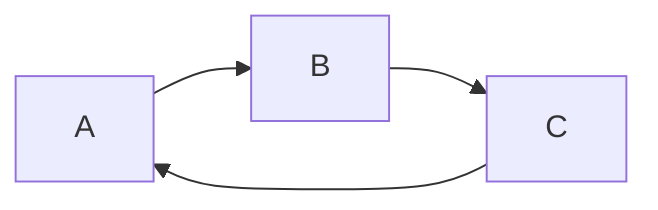

# Mermaid diagrams

Markdown code-fences tagged `mermaid` render as live SVG diagrams. The desktop adds a hover toolbar to every rendered diagram for copy / SVG / PNG export.

## Live preview while editing

Already covered by the Split mode introduced in #79: every `input` event in the editor triggers a 50 ms-debounced re-render of the preview pane, and that re-render includes mermaid blocks. So while you're typing inside ` ```mermaid …``` ` the diagram updates in place — no additional plumbing required.

## Toolbar

Hovering a rendered mermaid block reveals a top-right toolbar:

| Icon | Action |
| --- | --- |
| `copy` | Serializes the rendered `<svg>` and writes the markup to the clipboard. |
| `download` | Downloads `diagram.svg`. |
| `image` | Rasterizes the host div via `html-to-image` (toolbar excluded by a filter), 2× pixel-ratio, page background applied for nicer diff against light/dark themes; saves `diagram.png`. |

The original mermaid source is captured in `data-mermaid-source` on the host div for any future tools (e.g. an "edit diagram" popout) that need it.

## Out of scope (follow-up)

- **Cursor-aware popout preview**: when the cursor is inside a `\`\`\`mermaid` fence in the editor, render the block in a floating preview docked next to the cursor. Useful for diagrams beyond a screen height.
- **Standalone `.mmd` / `.mermaid` file support**: opening one would skip the markdown pipeline and treat the entire file as the diagram source.

## Files

- `apps/electron/renderer/renderer.ts` — `attachMermaidToolbar`, `copyMermaidSVG`, `downloadMermaidSVG`, `downloadMermaidPNG`, `serializeSVG`.
- `apps/electron/renderer/renderer.css` — `.mid-mermaid-toolbar` styles.

## Verifying

Open a markdown file with a mermaid block:

````markdown

````

- Diagram renders.
- Hover — toolbar fades in.
- Click `copy` — clipboard contains the SVG markup.
- Click `download` — `diagram.svg` saves and opens cleanly in any SVG viewer.
- Click `image` — `diagram.png` matches the current theme bg.
- Type in the editor (Split mode) — diagram updates after 50 ms.
