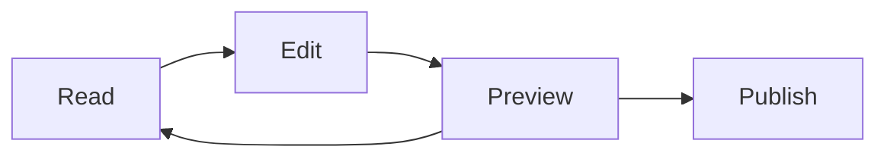

# Welcome to Mark It Down

A short tour of every renderer feature. Right-click anywhere to see the context actions.

> [!NOTE]
> This is a GitHub-style alert. Try `> [!TIP]`, `> [!IMPORTANT]`, `> [!WARNING]`, `> [!CAUTION]` too.

## Inline & display math

The Pythagorean theorem: $a^2 + b^2 = c^2$.

The Gauss integral:

$$ \int_0^\infty e^{-x^2}\,dx = \frac{\sqrt{\pi}}{2} $$

## Code with syntax highlighting

```ts
import { greet } from './greeter';

export async function main(): Promise<void> {
  const subject = process.argv[2] ?? 'world';
  console.log(greet(subject));
}
```

Right-click the block: Copy, Download, Export PNG, line numbers.

## A data table

| Project   | Stage      | Owner | LOC   |
| --------- | ---------- | ----- | ----- |
| Atlas     | Production | Sara  | 12345 |
| Beacon    | Beta       | Jamal |  4920 |
| Crescent  | Planning   | Lina  |   210 |
| Dawn      | Production | Karim |  8800 |
| Echo      | Sunset     | Mona  |  1500 |
| Fjord     | Beta       | Omar  |  6200 |

Click a column header to sort. Right-click for CSV / JSON / Markdown export.

## A diagram



Right-click the diagram for SVG / PNG export.

## Lists

- [x] Browse files in the sidebar
- [x] Right-click code / tables / diagrams for actions
- [ ] Try Settings (`Cmd/Ctrl+,`) — Sepia theme is the chef's kiss
- [ ] Connect a GitHub repo from the bottom status bar

Happy editing.
